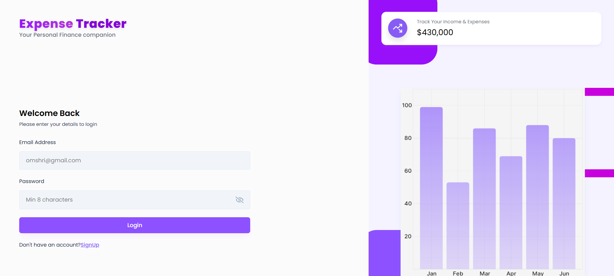
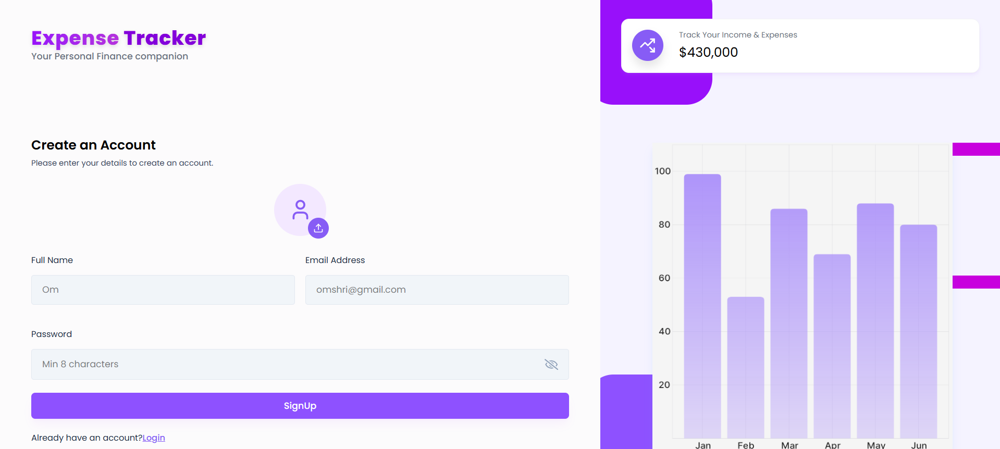
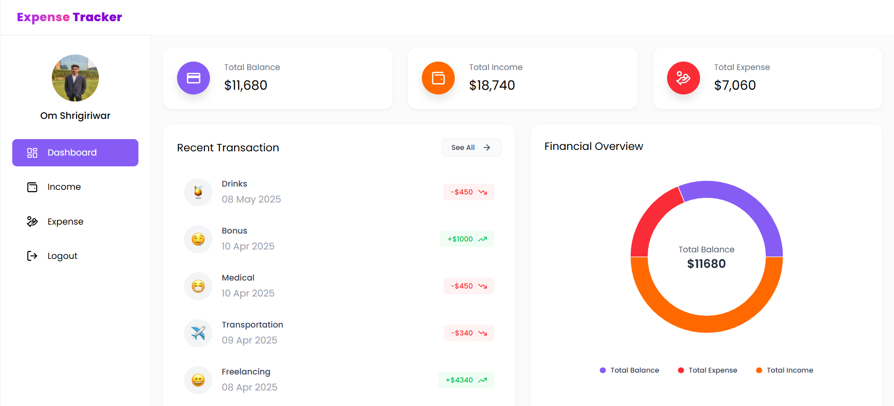
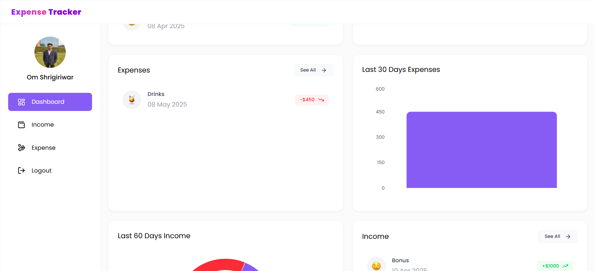
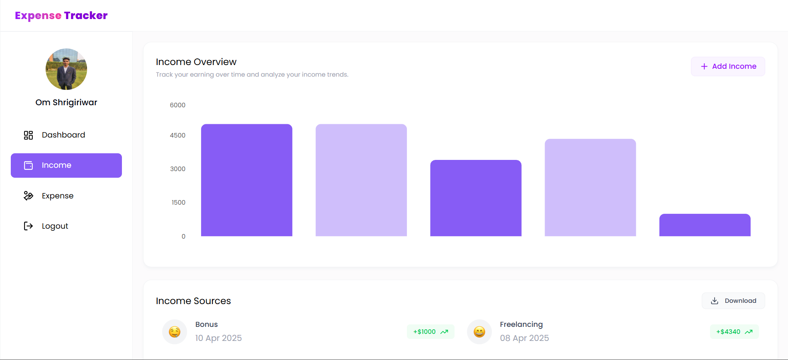
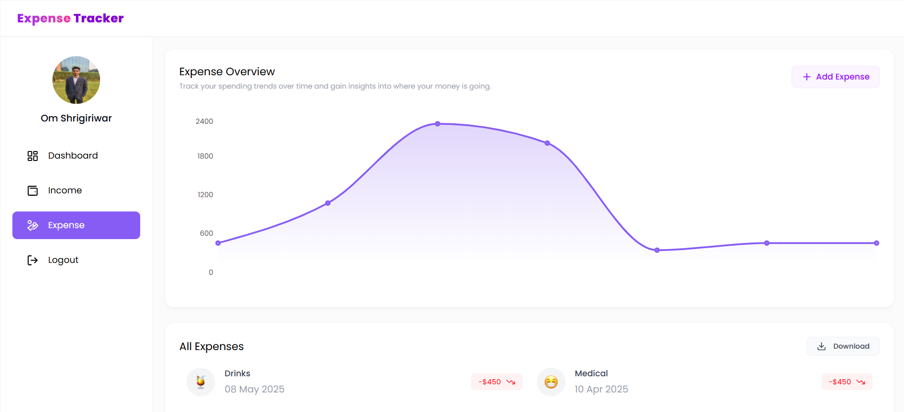

# 💸 Expense Tracker (MERN Stack)

A full-featured **Expense Tracker** built with the **MERN stack (MongoDB, Express, React, Node.js)**.  
Track your income and expenses, view interactive charts, filter by date, and export reports — all with a clean, modern UI.

---

## 🚀 Tech Stack

### 🖥 Frontend
- React 19 + Vite
- Tailwind CSS
- Recharts (for data visualization)
- Axios
- Emoji Picker
- React Router DOM
- Moment.js
- React Hot Toast

### 🔧 Backend
- Node.js
- Express
- MongoDB with Mongoose
- JWT Authentication
- Multer (for uploads)
- XLSX (for Excel export)
- Dotenv
- CORS

---

## ✨ Key Features

### Authentication & Security
- 🔐 JWT-based user authentication
- 🔒 Protected routes with middleware
- 👤 User-specific data isolation

### Financial Management
- ➕ Create income/expense records
- ✏️ Update existing transactions
- ❌ Delete entries
- 📆 Filter by date/month/year
- 🔍 Search functionality

### Data Visualization & Reporting
- 📊 Interactive charts (Pie/Bar charts)
- 📈 Expense/income trend analysis
- 📁 Export to Excel (.xlsx) format
- ⬇️ Automatic report downloads

### User Experience
- 📱 Responsive design
- 💬 Interactive notifications (React Hot Toast)
- 🎨 Emoji selection for categories
- ⚡ Fast performance with Vite

---

## 📸 Screenshots

### 🔐 Login & Signup
<p float="left">
  
  
</p>

---

### 📊 Dashboard Views
<p float="left">
  
  
</p>

---

### 💰 Income & Expense Pages
<p float="left">
  
  
</p>

---

## ⚙️ Getting Started

### Prerequisites
- Node.js v18+
- MongoDB Atlas account or local instance
- Git

### 1️⃣ Clone the Repository

```bash
git clone https://github.com/yourusername/expense-tracker-mern.git
cd expense-tracker-mern
```

### 2️⃣ Backend Setup

```bash
cd backend
npm install
```

### 3️⃣ Create a `.env` file

```env
MONGO_URI=your_mongodb_connection_string
JWT_SECRET=your_secure_jwt_secret
PORT=8000
```

### 4️⃣ Start the Backend

```bash
npm run dev
```

### 5️⃣ Setup Frontend

```bash
cd ../frontend
npm install
npm run dev
```

---

## 🌐 API Endpoints

> Sample endpoints — refer to `/backend/routes` for full route details.

- `POST /api/auth/login`
- `POST /api/auth/register`
- `POST /api/income/add`
- `GET /api/income/get`
- `DELETE /api/income/delete/:id`
- `POST /api/expense/add`
- `GET /api/expense/get`
- `DELETE /api/expense/delete/:id`
- `GET /api/dashboard/data`
- `GET /api/income/export`
- `GET /api/expense/export`

---

## 🧾 License

This project is licensed under the [MIT License](LICENSE).

---

## 👤 Author

**Om Shrigiriwar**  
GitHub: [@OmShrigiriwar](https://github.com/om67891)